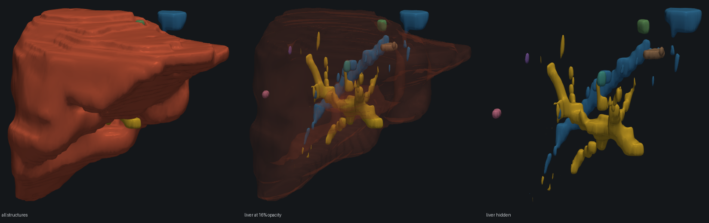

# nrrd-vis

Spacing-aware 3-D medical volume processing, morphometry and an interactive
viewer that fits in a browser tab.

Point it at any labelled segmentation — CT or MR, one structure or thirty — and
it measures every label in physical units and writes a self-contained HTML page
you can open, share or host.

Two live demos, both built from real public data by the commands below:

- **[Liver Morphometry Viewer](https://claude.ai/code/artifact/dd3c0ad8-4808-4401-b0c0-db9e03193149)**
  — MSD Task03 case `liver_108`: 57 tumours at 43% hepatic burden.
- **[Hepatic Segmentation Viewer](https://claude.ai/code/artifact/74d55290-1449-4e58-bb86-f1ce26e77257)**
  — a clinical **DICOM SEG** from TCIA Colorectal-Liver-Metastases: liver, the
  hepatic and portal vein trees, and five metastases.

Drag to orbit, drop the opacity to see structures inside the organ, or cut
through with the clip plane.



*The same scene at three opacity settings, straight from a clinical DICOM SEG.
The disconnected vessel stubs are not noise: at 0.887 mm in-plane against 5 mm
between slices, a vessel a few millimetres across is sampled as isolated
cross-sections. The measurements say the same thing — the hepatic vein reports
150 components with the largest holding 46%.*

These are rendered by `examples/render_views.py`, which draws the same meshes
the viewer draws through the same scene assembly, so the pictures cannot drift
from the tool.

```bash
nrrdvis view liver_0.nii.gz -o liver.html --labels "1=liver,2=tumour" --split 2 --min-volume 100
```

Real output, MSD Task03 Liver case `liver_0`:

```
wrote liver.html  (12 structures, 65,532 triangles, 1,569 KB)

structure    volume (mL)  max Ø (mm)  surface (cm²)  sphericity  parts
liver            1359.65       244.2          940.0       0.631      2
tumour_1 *          2.68        20.2            9.8       0.952      1
tumour_2 *          0.89        13.3            4.0       1.000      1
tumour_3 *          0.81        14.5            4.3       0.972      1
tumour_4 *          0.39        12.8            2.3       1.000      1
tumour_5 *          0.36        11.6            2.3       1.000      1
tumour_6 *          0.34        10.3            1.9       1.000      1
tumour_7 *          0.33        12.2            2.1       1.000      1
tumour_8 *          0.24         9.1            2.1       0.882      1
tumour_9 *          0.13         6.9            1.4       0.868      1
tumour_10 *         0.11         6.0            1.2       0.952      1
tumour_11 *         0.11         5.5            1.2       0.923      1

* spans under 5 voxels on its thinnest axis; shape figures are indicative only
```

Two things in that table are the point of the rewrite. The liver reports
`parts = 2`, so the segmentation is not one connected region. And every lesion
is flagged: at this scan's 5 mm slice thickness a 6 mm lesion spans barely more
than one slice, so its volume and diameter are usable but its shape is not.
Neither fact is visible from a rendering alone.

---

## Contents

- [What this is](#what-this-is)
- [Install](#install)
- [Quickstart](#quickstart)
- [The viewer](#the-viewer)
- [Measurements](#measurements)
- [How it is validated](#how-it-is-validated)
- [Modalities](#modalities)
- [What 131 livers looked like](#what-131-livers-looked-like)
- [Python API](#python-api)
- [What changed from v1](#what-changed-from-v1)
- [Layout](#layout)

---

## What this is

This began as a 2020 master's project on liver and tumour segmentation from
abdominal CT: preprocess DICOM, segment, stack slices into NRRD, render a 3-D
surface, measure it. That code is preserved in [`legacy/`](legacy/) and the
[notes there](legacy/README.md) describe what each script contributed.

v2 is a rewrite around one idea the original was missing: **a volume is not an
array — it is an array plus the physical geometry needed to interpret it.**
Every measurement here is in millimetres and litres because spacing is carried
through resampling, cropping and meshing rather than being tracked separately
and quietly invalidated.

The second idea is that **none of it should know what a liver is**. The
pipeline takes whatever integer labels it finds, so the same command renders a
liver study, a spleen study or a whole-body multi-organ segmentation.

## Install

```bash
git clone https://github.com/robert-piecyk/nrrd-vis
cd nrrd-vis
pip install -e ".[all]"
```

Python 3.10+. The core needs numpy, scipy, scikit-image and SimpleITK; DICOM
reading and mesh decimation are optional extras.

## Quickstart

No data needed — the phantom generator produces a synthetic torso with an
organ, lesions and bone:

```bash
nrrdvis demo -o demo.html
```

With real data:

```bash
# What am I looking at?
nrrdvis info scan.nii.gz

# Measure every label
nrrdvis measure segmentation.nii.gz --labels "1=liver,2=tumour" --split 2 --json out.json

# Build the viewer
nrrdvis view segmentation.nii.gz -o scene.html --labels "1=liver,2=tumour" --split 2

# Preprocess a raw CT series
nrrdvis prep dicom_directory/ prepped.nrrd --window abdomen --isotropic 1.0

# Convert formats, keeping spacing and origin
nrrdvis convert dicom_directory/ volume.nrrd
```

`--split` breaks a label into connected components so multifocal disease is
measured lesion by lesion instead of as one blob.

### Formats

| Input | Notes |
|---|---|
| NIfTI, NRRD, MetaImage | Single files, read through SimpleITK |
| DICOM series (directory) | Ordered by ImagePositionPatient, never by filename |
| DICOM SEG | `load_dicom_seg()` for a label map, `dicom_seg_masks()` when segments overlap |

CT is assumed to be in Hounsfield units. MR and other uncalibrated data are
detected, and the parts of preprocessing that need an absolute scale either
adapt or refuse — see [Modalities](#modalities).

### Getting a dataset

Any NIfTI, NRRD, MetaImage or DICOM series works. The
[Medical Segmentation Decathlon](http://medicaldecathlon.com/) tasks are a good
starting point and have a built-in adapter:

```python
from nrrdvis.datasets import MSDDataset, download_command

print(download_command("liver", "./data"))   # prints the curl+tar command
dataset = MSDDataset("./data/Task03_Liver")  # labels read from dataset.json
image, labels = dataset.cases[0].load()
```

## The viewer

Output is one HTML file with a single external dependency (three.js from a
pinned CDN). Geometry is embedded as base64 binary and decoded into typed
arrays in the browser.

- Drag to orbit, scroll to zoom, shift-drag to pan
- Per-structure visibility, with volumes in the sidebar
- Global opacity, so lesions can be seen through the organ containing them
- A clip plane on any anatomical axis, for cutting into the volume
- A scale bar in millimetres that tracks the camera
- Measurements and acquisition geometry alongside the render
- Light and dark themes, and a layout that works on a phone

Size is bounded by a per-structure triangle budget (`--max-faces`), so output
stays in the hundreds of kilobytes rather than growing with scan resolution.

## Measurements

For every label, and optionally for every connected component within a label:

| Quantity | Notes |
|---|---|
| Volume (mm³ and mL) | Voxel count times true voxel volume |
| Max diameter | True 3-D Feret diameter over the convex hull, not a per-slice approximation |
| Surface area | Marching-cubes triangulation, calibrated against analytic spheres |
| Sphericity | Equivalent-sphere area over measured area; 1.0 is a sphere |
| Centroid, bounding box | Millimetres, in patient coordinates |
| Component count | Plus the fraction held by the largest, which flags fragmented predictions |

Structures spanning fewer than five voxels on their thinnest axis are marked
`resolution_limited`. Their volume and diameter remain usable; their shape
descriptors are dominated by sampling artifacts and are reported as indicative
only rather than silently presented as fact.

`lesion_burden()` aggregates components into the figures a report wants: lesion
count, total and largest volume, largest diameter, and the sum of diameters
that RECIST tracks between timepoints.

## How it is validated

Measurement code that is only checked against itself will happily be
self-consistently wrong. The phantom generator emits shapes whose geometry is
known in closed form, and the tests assert against that arithmetic:

| Property | Result |
|---|---|
| Sphere volume vs `4/3 πr³` | within 0.07% |
| Sphere surface area vs `4πr²` | within 0.6% |
| Sphere max diameter vs `2r` | exact to the voxel |
| Sphere sphericity | 1.000 ± 0.003 |
| Rod sphericity vs closed form | within 0.08 absolute |
| Volume across three different voxel grids | within 0.5% of each other |
| Mesh-enclosed volume vs voxel count | within 0.5% |
| Volume after 20 Taubin smoothing passes | within 0.5% of unsmoothed |

That last row is the reason smoothing is Taubin rather than Laplacian:
Laplacian smoothing contracts a closed surface a little on every iteration, so
volume measured off a smoothed mesh drifts steadily downward.

The surface-area calibration is worth stating explicitly. Marching cubes on a
hard binary mask traces a staircase and overestimates area by about 9%. A
Gaussian pre-smooth of 0.8 voxels holds the error under 1% across the radii
tested; the tests pin both the corrected value *and* the uncorrected artifact,
so a regression in the fix is visible rather than silent.

```bash
pytest              # 138 tests, including 39 headless checks on the generated viewer
ruff check src tests
```

## Modalities

Preprocessing was written for CT, where Hounsfield units are calibrated so air
sits near −1000. Nothing else shares that scale, and the failures were silent
until they were checked against a real liver MR from TCGA-LIHC (intensities 0
to 831):

| Operation | On non-HU data before | Now |
|---|---|---|
| `body_mask` | Selected **87%** of the field of view — every voxel is "above −320 HU" | Detects uncalibrated data, falls back to an Otsu threshold: **37.9%** |
| `apply_window("abdomen")` | Clipped to [−160, 240], collapsing everything above 240 into one value | Raises, and points at `window="percentile"` |

`is_hounsfield()` is the check; `percentile_window()` is the alternative for
data with no absolute scale. CT behaviour is unchanged and pinned by a test.

## What 131 livers looked like

`examples/cohort_report.py` measures every case in a dataset in parallel and
reports what disagrees with the cohort. On MSD Task03 Liver (131 cases,
CC-BY-SA 4.0):

```
slice thickness (mm)  0.70 to 5.00   median 1.00
in-plane spacing (mm) 0.557 to 1.000  median 0.768
anisotropy (z / x)    1.2x median, up to 9.0x

organ volume (mL)     542 to 3195   median 1592   IQR 1380-1850
organ components      1 to 1777   93 case(s) not a single connected region
  stray volume (mm3)  0.0 to 4573.0   median 8.8   worst 0.360% of its organ

cases with lesions    117 of 131
lesions per case      1 to 62   median 3   total 753
lesion burden (%)     0.01 to 45.8   median 0.97
largest lesion Ø (mm) 10 to 241   median 40
```

Three things worth drawing out.

**Slice thickness spans 7x within one dataset**, and anisotropy reaches 9:1.
Any pipeline with kernel sizes tuned in voxels behaves differently across this
cohort without saying so. This is the concrete reason v1's `np.ones((15, 15))`
had to become a millimetre radius.

**71% of liver labels are not a single connected region** — but the median
stray volume is 8.8 mm³, and the worst case is 0.36% of its organ.
`liver_116` reports 395 components at face-adjacency and 27 at 26-adjacency;
232 of those "components" are single voxels touching the main body only at a
corner. The count is an artifact of the connectivity choice. Stray volume is
the number that means something, which is why the report leads with it.

**Fragmentation correlates with low sphericity, but mostly for a boring
reason.** Across the cohort, `n_components` against sphericity gives Spearman
ρ = −0.58 (p = 2×10⁻¹³), which invites the conclusion that annotation speckle
inflates surface area and drags shape metrics down. It does not survive
scrutiny: `n_components` and tumour burden correlate at ρ = +0.85, so heavily
diseased livers are both genuinely more irregular *and* more fragmented.
Controlling for burden, the partial correlation falls to −0.32. A residual
association remains, but observational data cannot separate "speckle inflates
area" from "disease does both", and the honest reading is that most of the
headline effect is confounded.

Reproduce with:

```bash
python examples/cohort_report.py /path/to/Task03_Liver \
    --organ 1 --lesion 2 --min-lesion-mm3 100 --workers 20 \
    --out outputs/liver_cohort.jsonl
```

Records stream to JSONL and the run resumes from whatever is already there, so
an interrupted scan over 131 large volumes keeps its work.

## Python API

```python
import nrrdvis
from nrrdvis.viewer import scene_from_labelmap, write

image  = nrrdvis.load("scan.nii.gz")           # DICOM dir, NIfTI, NRRD, MetaImage
labels = nrrdvis.load("segmentation.nii.gz")

image.spacing          # (5.0, 0.977, 0.977) mm, as (z, y, x)
image.extent_mm        # physical field of view
image.resample(1.0)    # isotropic; extent is preserved, spacing updated

liver   = nrrdvis.measure_label(labels, 1, "liver")
tumours = nrrdvis.measure_components(labels, 2, "tumour", min_volume_mm3=50)

print(f"{liver.volume_ml:.0f} mL, {len(tumours)} lesions")
print(nrrdvis.lesion_burden(tumours, reference_volume_ml=liver.volume_ml))

scene = scene_from_labelmap(
    labels,
    names={1: "liver", 2: "tumour"},
    split_labels=(2,),        # one mesh and one row per lesion
    min_component_volume_mm3=50,
)
write(scene, "scene.html")
```

Preprocessing is declarative, so a run can be recorded next to its output:

```python
from nrrdvis.preprocess import PreprocessConfig, run

config = PreprocessConfig(window="abdomen", isotropic_mm=1.0, denoise_mm=0.0)
print(config.describe())   # "resample to 1.0 mm isotropic; body mask with 8.0 mm closing; abdomen window"
prepped = run(image, config)
```

## What changed from v1

The rewrite was driven by specific defects, not by taste. Each of these is now
covered by a test.

**Spacing was tracked separately from the data.** v1 held voxels in a numpy
array and millimetres in a `pydicom` dataset, then called `cv2.resize(img,
(256, 256))`. The array changed shape, the spacing did not, and every
subsequent measurement was wrong by the resize factor. `Volume` binds the two
and updates spacing on every geometric operation.

**Volume was estimated from a voxel-fraction of the field of view** — the
fraction of voxels at 255 times the total scanned volume — and then divided by
1e6 and labelled litres, which is off by a factor of 1000. It is now a voxel
count times the true voxel volume, and 1 mL is 1000 mm³.

**"Diameter" was the widest axial slice's index span.** That ignores oblique
extent entirely and cannot see the z direction. It is now the true 3-D Feret
diameter, computed over the convex hull of the surface voxels.

**Morphological kernels were defined in voxels.** `np.ones((15, 15))` closes a
different physical gap on every scanner. Structuring elements are now specified
in millimetres and converted per volume, which on anisotropic data means an
ellipsoid in voxel space.

**Slices were ordered by filename.** This is not a theoretical risk. A liver CT
from TCIA (HCC-TACE-Seg) is named `00000001.dcm` onward — perfectly
natural-sortable — yet **46 of its 88 adjacent pairs are out of anatomical
order**, with a mean index displacement of 31 slices. v1 would have
reconstructed noise from it and raised no error. Ordering now comes from
ImagePositionPatient, and a test writes a deliberately shuffled series to prove
it.

**Processing was 2-D throughout.** The body mask was computed per slice, so a
slice where the body split into two blobs — routine at the top and bottom of a
series — lost half the anatomy to the largest-component step. It now runs on
the whole volume.

**The viewer did not scale.** Raw marching-cubes output went straight into
Plotly's `create_trisurf`, which serialises every vertex as decimal text and
inlines the whole plotly.js bundle. The committed `temp-plot.html` was 18 MB
for a single structure. Meshes are now decimated to a budget and shipped as
base64 binary: the five-structure phantom scene is 902 KB, and the twelve-structure
liver scene above is 1.5 MB.

**Nothing was runnable by anyone else.** Every path was `E:/Desktop/`, the
patient list was `range(1, 21)`, there was no README, no requirements, no
tests, and 20 MB of generated artifacts were committed. Paths are arguments,
dependencies are declared, and CI runs the suite on three Python versions.

Two things v1 imported but never actually contained: a U-Net (the Keras layers
are imported in every file, but no model is ever defined) and any evaluation
(the `evaluate` function is commented out). Segmentation is therefore out of
scope here — this package takes a segmentation as input. Producing one is the
natural next piece of work.

## Layout

```
src/nrrdvis/
├── volume.py        Volume: array + spacing + origin, geometry-preserving ops
├── io.py            DICOM series, NIfTI, NRRD, MetaImage; the (x,y,z)/(z,y,x) flip
├── preprocess.py    HU windowing, body extraction, denoising, declarative config
├── measure.py       Volumetry, Feret diameter, surface area, sphericity, burden
├── mesh.py          Marching cubes, quadric decimation, Taubin smoothing
├── phantom.py       Synthetic volumes with closed-form geometry
├── cli.py           measure · view · prep · convert · info · demo
├── viewer/
│   ├── scene.py     Label-agnostic scene assembly and palette
│   └── html.py      Self-contained page: base64 geometry, inline three.js viewer
└── datasets/
    └── msd.py       Medical Segmentation Decathlon adapter
```

## Licence

MIT. The datasets it reads carry their own terms; MSD tasks are CC-BY-SA 4.0.
